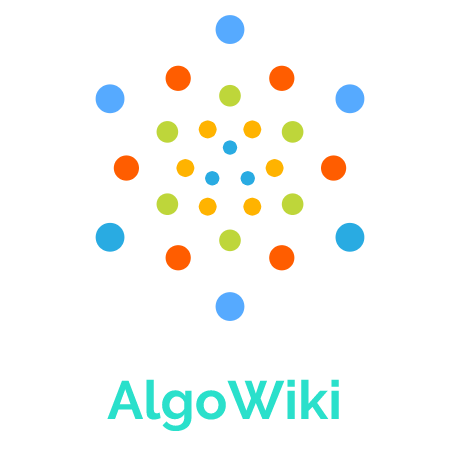

	

<h1 align="center">Building Knowledge Repositories</h1>

On the Internet, there is a vast ocean of knowledge on different and varied topics. Most of this knowledge is either available online on the web or resides with the people as human knowledge. I want to create this repository as a platform to bind these scattered pieces of knowledge, spread over various websites at one place! 

## Navigation

**Some of the links below contain only Pdfs books. We will add websites and video resources soon!**

* [All about Competitive-Programming](Competitive-Programming/Competitive-Programming.md)
* [Algorithms and Their Implement from different sources](Algorithms/Sources.md)
* [Free Algorithm Books](Free-Books/Algorithms-Data_Structures.md)
* [Free Data Science Book pdfs](Free-Books/Data%20Science.md)
* [Machine Learning](Machine-Learning/Sources.md)
* [Artificial Intelligence](Artifical_Intelligence/resources.md)
* [All about C](C/sources.md)
* [All about C++](C_plus_plus/resources.md)
* [All about Java](java/Java_Resources.md)
* [All about Objective-C](Objective_C/sources.md)
* [All about Python](python/resources.md)
* [All about php](PHP/php_resources.md)
* [All about MySql](MySql/mysql_resources.md)
* [All about R](R/resources.md)
* [All about Rust](Rust/rust_resources.md)
* [HTML](HTML_CSS/html_resources.md)
* [Django](Django/resources.md)
* [Flask](Flask/flask_resources.md)
* [Interview Preparation](Interviews/resources.md)
* [JavaScript](JAVASCRIPT/resources.md)
* [JavaScript Guide](https://github.com/airbnb/javascript/blob/master/README.md)
* [Rails](Rails/rails_resources.md)
* [Ruby](Ruby/ruby_resources.md)
* [Linux](Linux)
* [Compilers](Compilers/resources.md)
* [Open Source Guide](https://opensource.guide/)
* [Discrete Mathematics](https://github.com/vicky002/AlgoWiki/blob/gh-pages/Discrete%20Mathematics/discrete-math.md)

How to Contribute
==================
We are collecting links to websites and resources. Send files, pdfs, printed articles or your bookmark folder @tvicky002@gmail.com 

Read Our Contribution Page
=======================
* [Contributing to this repository](https://github.com/vicky002/Wiki_Knowledge/wiki/Contribution)
1. You can add links of different sources on different topics.
2. You can also create topics and add different resources to it.
3. Make sure that links that you provide are related to the topic!

Topics
======
- Algorithms
- Operating System
- Competitive Programming
- Web Languages:
 -  Html
 -  Javascipt
 -  JQuery
 -  PHP 
 -  Django
 -  Rails
- Programming Languages:
 - C
 - C++
 - Java
 - Objective-C
 - Python
 - Ruby
 - Rust
- Machine Learning
- Artificial Intelligence
- Android
- Discrete Mathematics
- Compilers
- Web2py

There are many topics, you can contribute to – Just create topics and add resources to it!

Built with :heart: in GitHub! 

LICENCE: [MIT](LICENSE) (c) Vikesh Tiwari, AlgoWiki
